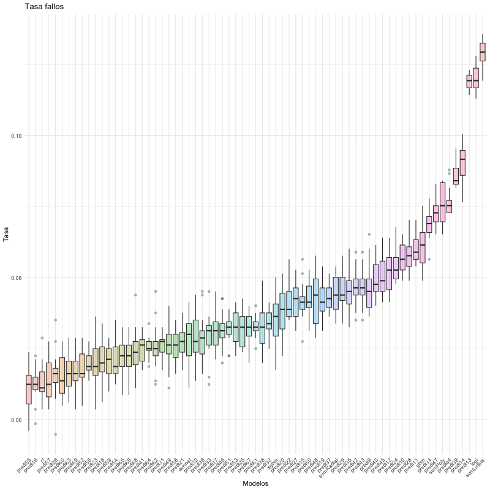
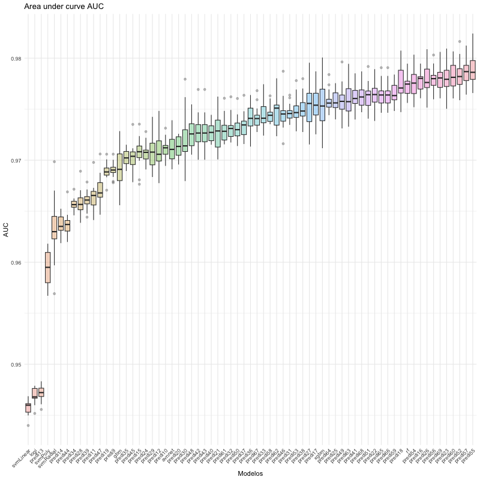
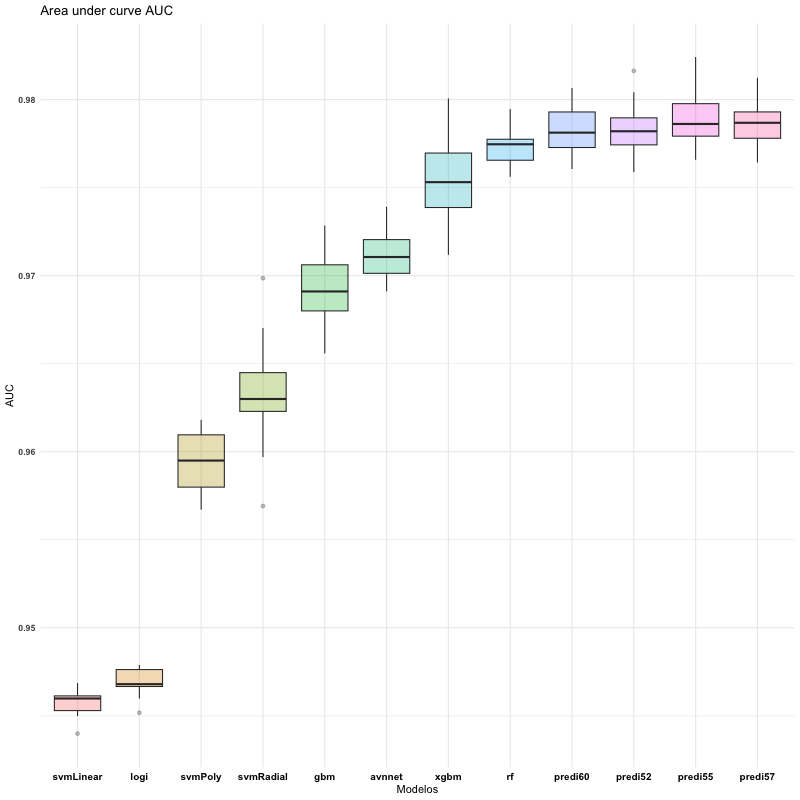

```{r include=FALSE, warning=FALSE}
library(dplyr)
load('myEnvironment.RData')
source("./src/functions/cruzadas ensamblado binaria fuente.R")
source("./src/functions/genera_graficos.R")
knitr::opts_chunk$set(warning = FALSE) 
knitr::read_chunk("5_Ensamblado.R")

```

```{r setup, include=FALSE}
knitr::opts_chunk$set(echo = TRUE)
```

# Ensamblado de algoritmos

**Nota:** El código completo de la practica de ensamblados se encuentra en el
siguiente repositorio de GitHub, para no extender innecesariamente el reporte:
<https://github.com/TiaIvonne/Machine-LearningR/blob/master/5_Ensamblado.R>

## Preparacion del ensamblado con *caret ensemble*

Antes de comenzar el modelado, se deben tener decididos los parámetros para los
algoritmos que serán ensamblados (proceso obtenido anteriormente en el apartado
de tunning) para los siguientes algoritmos:

Redes neuronales Gradient boosting machine Random Forest Classifier Support
Vector Machines (lineal, polinomial y radial)

Con los resultados obtenidos se construyen los *grids* y se realiza el
modelamiento

\tiny

```{r chunk-ensamblado1, eval=FALSE, echo = TRUE}
```

\normalsize

Se despliegan los resultados obtenidos para el ensamblado

\tiny

```{r chunk-ensamblado2, eval=FALSE, echo=TRUE}
```

\tiny

```{r, eval=TRUE, message=FALSE}
summary(ensemble)
```

\normalsize

Observaciones

## Validacion cruzada repetida y boxplot

Siguiendo la guia de ensamblados entregada en el material, se realizan los pasos
requeridos para realizar pruebas de ensamblado y validacion cruzada repetida

### Paso 1, carga del archivo con la funcion "cruzadas ensamblado binaria fuente.R"

### Paso 2, Preparacion del archivo

Se define semilla, variables y repeticiones

### Paso 3, aplicacion de la funcion cruzadas ensamblado

Con los datos obtenidos del proceso de tunning se construyen las nuevas medias a
evaluar bajo la función "cruzadas ensamblado binaria fuente.R".

Solo se adjunta una muestra del código generado

\tiny

```{r, eval=FALSE}
medias_1<-cruzadalogistica(data = archivo,
    vardep = vardep,
    listconti=listconti,
    listclass = listclass, grupos = grupos,
    sinicio = sinicio, repe = repe)

medias1bis <- as.data.frame(medias_1[1])
medias1bis$modelo<-"logistica"
predi1<-as.data.frame(medias_1[2])
predi1$logi<-predi1$Yes

medias_2<-cruzadaavnnetbin(data=archivo,
    vardep=vardep,listconti=listconti,
    listclass=listclass,grupos=grupos,sinicio=sinicio,repe=repe,
    size=c(10),decay=c(0.01),repeticiones=5,itera=200)

medias2bis<-as.data.frame(medias_2[1])
medias2bis$modelo<-"avnnet"
predi2<-as.data.frame(medias_2[2])
predi2$avnnet<-predi2$Yes

medias_3<-cruzadarfbin(data=archivo,
    vardep=vardep,listconti=listconti,
    listclass=listclass,grupos=grupos,sinicio=sinicio,repe=repe,
    mtry=3,ntree=500,nodesize=10,replace=TRUE)

medias3bis<-as.data.frame(medias_3[1])
medias3bis$modelo<-"randomforest"
predi3<-as.data.frame(medias_3[2])
predi3$rf<-predi3$Yes

# Se ha omitido el resto del código
```

\normalsize

Con la función genera graficos y una vez calculadas las medias en el proceso
anterior se obtiene el gráfico de cajas respectivo: \tiny

```{r chunk-ensamblado3, eval=FALSE, echo=TRUE, fig.align='center', out.width="50%"}
```

\normalsize

### Paso 4, construccion del ensamblado

Con las predicciones obtenidas en las respectivas variables predi1, predi2,
predi3 etc se crean los ensamblados. Solo se adjunta una muestra del código

\tiny

```{r, eval=FALSE}
unipredi<-cbind(predi1,predi2,predi3,predi4,predi5,predi6,predi7,predi8)
ncol(unipredi)

unipredi<- unipredi[, !duplicated(colnames(unipredi))]
ncol(unipredi)

unipredi$predi9<-(unipredi$logi+unipredi$avnnet)/2
unipredi$predi10<-(unipredi$logi+unipredi$rf)/2
unipredi$predi11<-(unipredi$logi+unipredi$gbm)/2
unipredi$predi12<-(unipredi$logi+unipredi$xgbm)/2
unipredi$predi13<-(unipredi$logi+unipredi$svmLinear)/2
unipredi$predi14<-(unipredi$logi+unipredi$svmPoly)/2

```

### Paso 5, Procesado de los ensamblados

Solo se adjunta una parte del código, se construyen los promedios de tasa de
fallos y AUC.

\tiny

```{r chunk-ensamblado5, eval=FALSE}

```

\normalsize

### Paso 6, boxplot inicial

Boxplot con tasa de fallos para todos los ensamblados, en el punto 8 se muestran
ordenados

### Paso 7, tabla con resultados

Se genera tabla con resultados para la tasa de fallos y el área under curve.
**Nota:** Solo se despliegan las primeras salidas para no extender el documento.
\tiny

```{r chunk-ensamblado7}

```

\normalsize

En el punto siguiente se gráfica para una mejor visualización y toma de decisión

### Paso 8, Boxplot ordenados para comparacion de medias

Con los resultados obtenidos de los ensamblados se generan los boxplot ordenados
por tasa de fallos y auc respectivamente: \tiny

```{r, out.width = "70%", fig.align='center'}

```

\normalsize

En tasa de fallos los modelos con menor tasa son predi55, predi16, randomforest
\tiny

```{r,out.width="70%", fig.align='center'}

```

\normalsize

En AUC respectivamente los modelos con mayor *accuracy* son predi55, predi57 y
predi52.

Como se observa en el gráfico son demasiados modelos, en el apartado siguiente
solo se trafican los mejores modelos de ensamblado y se comparan con los
algoritmos sin ensamblar

### Paso 9, comparacion de mejores modelos

Los mejores ensamblados son los modelos predi57, predi55, predi52 y predi 60,
estos se muestran a continuación comparándolos con los modelos originales sin
ensamblar

```{r, fig.align='center', out.width="50%",echo=FALSE}

```

### Paso 10, revision a los mejores ensamblados

\tiny
```{r, echo=TRUE, eval=FALSE}
unipredi$predi55<-(unipredi$rf+unipredi$xgbm+unipredi$svmRadial)/3
unipredi$predi57<-(unipredi$rf+unipredi$avnnet+unipredi$xgbm)/3
unipredi$predi60<-(unipredi$rf+unipredi$avnnet+unipredi$svmRadial)/3
unipredi$predi52<-(unipredi$rf+unipredi$gbm+unipredi$svmRadial)/3
```
\normalsize
En los ensamblados el algoritmo común en los cuatro mejores ensamblados es
random forest, el mejor ensamblado es el numero 55 que mezcla random forest,
xgbm y svm radial.

### Observaciones finales

-   De los modelos originales los mejores resultados observando el gráfico los
    obtiene random forest, xgbm y avnnet, xgbm presenta mas varianza que los dos
    anteriores.
-   El *accuracy* alcanzado por los ensamblados es mas alto si se compara con
    los modelos originales sin ensamblar. Si solo fuese tomando como criterio el
    accuracy, predi57 que es un ensamblado de randomforest con xgbm y svmlineal
    seria el modelo *ganador*. Sin embargo no hay diferencias dramáticas desde
    randomforest hacia adelante y considerando sesgo-varianza, randomforest
    estaría mostrando mejores resultados que los ensamblados.
-   La tasa de fallos vs el auc muestra algunas incoherencias, en tasa de fallos
    el numero menor lo obtienen predi55 y predi16 pero en auc los ensamblados
    predi55 y predi57 respectivamente están a la cabecera de los resultados.
